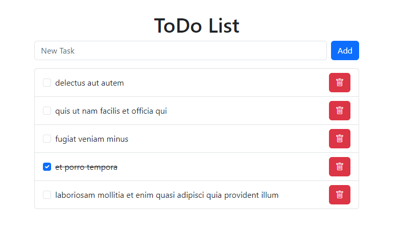

# React + Vite

This template provides a minimal setup to get React working in Vite with HMR and some ESLint rules.

Currently, two official plugins are available:

- [@vitejs/plugin-react](https://github.com/vitejs/vite-plugin-react/blob/main/packages/plugin-react) uses [Babel](https://babeljs.io/) (or [oxc](https://oxc.rs) when used in [rolldown-vite](https://vite.dev/guide/rolldown)) for Fast Refresh
- [@vitejs/plugin-react-swc](https://github.com/vitejs/vite-plugin-react/blob/main/packages/plugin-react-swc) uses [SWC](https://swc.rs/) for Fast Refresh

## React Compiler

The React Compiler is currently not compatible with SWC. See [this issue](https://github.com/vitejs/vite-plugin-react/issues/428) for tracking the progress.

## Expanding the ESLint configuration

If you are developing a production application, we recommend using TypeScript with type-aware lint rules enabled. Check out the [TS template](https://github.com/vitejs/vite/tree/main/packages/create-vite/template-react-ts) for information on how to integrate TypeScript and [`typescript-eslint`](https://typescript-eslint.io) in your project.
======================================================================================================================
# React To-Do List App

A simple To-Do List application built using **React** and **plain Bootstrap**.



## Requirements

### App Structure:

- Create a React component to manage tasks.
- Use plain **Bootstrap** classes for styling.

### Functionalities:

1. **Add Task**:
   - Input field and an "Add" button to create new tasks.
2. **Complete Task**:
   - Checkbox to mark tasks as complete (strikethrough the text).
3. **Delete Task**:
   - Button with a trash icon to remove a task from the list.

### Bootstrap Usage:

- Use `form-control` for input, `btn` for buttons, and `list-group` for the task list.

### State Management:

- Use React `useState` to manage tasks (task name, completion status).

### Icons:

- Use **Bootstrap Icons** for the delete button.

## Steps to Make This App:

1. **Set up State**:

   - Create a `tasks` state using `useState` to manage the list of tasks.

2. **Add Input and Button**:

   - Use an input field for new tasks and a button with `btn-primary` to add tasks.

3. **Add Task List**:

   - Use `list-group` and `list-group-item` classes to display tasks.
   - Use a checkbox to mark tasks as complete and apply a `line-through` style for completed tasks.

4. **Use Bootstrap Icons**:

   - Install Bootstrap Icons and use the `bi-trash` icon for the delete button.

5. **Fetching Initial Tasks**:

   - Use the `useEffect` hook to fetch initial data from an external API (jsonplaceholder).

   Add this code to fetch the first 5 tasks from the API and display them in the list:

   ```js
   const res = await fetch(
     "https://jsonplaceholder.typicode.com/todos?_start=0&_limit=5"
   );
   ```
